# Lumi & the Sleepy Worlds — external review brief

**Prepared for:** an outside model (Gemini) asked to do deep research on this
project, critique it hard, and propose additions.
**Date:** September 2026 · **Status:** working prototype, unshipped, unpushed.
**Repo:** `mahikshith/bedtime-stories-`, branch `claude/bedtime-stories-app-6vk9be`.
**Figures:** `docs/brief-images/` — referenced inline throughout.

---

## 0. What we want from you

Read all of it, then be adversarial. Specifically:

1. **Attack the business case.** The market ceiling we measured is low (§2.5).
   Is a one-time-purchase, zero-backend kids' app a viable business in 2026, or
   is it a hobby with a store listing?
2. **Attack the differentiation.** Our claim is that we are the only kids' app
   whose explicit goal is to *end* the session. Is that a real wedge, or a
   feature a competitor copies in a sprint?
3. **Attack the content moat.** 216 composed stories, 22 rhymes, 8 games. Is
   hand-authored, on-device content defensible when every competitor can call a
   model? (Our counter is §6 rule 1: their marginal cost is not zero, ours is.)
4. **Attack the UI.** Figures are in §5. It targets 390px phones and children
   who cannot read. Tell us what a five-year-old will fail at.
5. **Find the compliance landmine we missed.** COPPA's amended rule, Play
   Families, Apple Kids Category. We think we are clean *by architecture*
   (§6). Show us where we are not.
6. **Invent.** The single most useful thing you can give us is a genre or a
   mechanic we have not thought of that fits the constraints in §6. The
   constraints are hard — a proposal that needs a server, an account, or a
   per-use API call is out of scope by construction, not by preference.

Do not propose: a subscription with server-side content, an ad-supported tier,
speech recognition, user accounts, a social feed, or LLM chat with the child.
Each is ruled out in §6 for reasons that are architectural, legal, or both.

---

## 1. What the product is, in one paragraph

An offline-first, no-account, no-analytics phone app for a household with
children roughly 3–11. It has five pillars — **rhymes, games, create, learn,
stories** — arranged on a **day arc**: the app checks the clock and offers loud
things in the morning, playful things in the afternoon, and quiet things after
6pm, ending in a bedtime story whose palette, narration speed and mascot all
get sleepier as the story runs. Stories are personalised with the child's name,
which never leaves the phone. It is free to install, free for seven nights,
then one payment for the household forever.

---

## 2. Who exactly we are building this for

This section did not exist before this brief; it is the part most in need of
outside challenge.

### 2.1 The buyer (who pays)

A parent or carer, 28–45, of **one to four children aged 3–11**, in an
English-speaking, high-ARPU market — US, UK, Canada, Australia, Ireland, NZ.
They are the person holding the phone at 7:30pm. They are not shopping for an
education product; they are trying to get a specific child into bed without a
fight, tonight.

Three things are true of them at once, and the product exists in the overlap:

- **They feel guilty about screen time.** They will pay a premium for a screen
  that is defensibly *part of the bedtime routine* rather than a bribe that
  replaces it.
- **They have been burned by subscriptions.** They have an ABCmouse or a
  Lingokids charge they forgot to cancel. "One payment, whole household,
  forever" is the single strongest line we have.
- **They do not trust kids' apps with data.** They have read at least one story
  about a children's app leaking something. "There is no server" is a claim
  almost nobody else in the category can make, and we can prove it in the
  binary.

### 2.2 The user (who plays)

**Three distinct children, not one.** The app must work for all three at once
because they live in the same house and share the same purchase:

| Band | Reads? | What they can actually do | What they get |
|---|---|---|---|
| **3–5** | No | Taps big things, repeats words, cannot read a menu | Rhymes with actions, Wake the Animal, colouring, being read to |
| **6–8** | Learning | Reads short words, follows a two-step instruction | Cloze rhymes, phonics sets, Lumi's Leap, full stories |
| **9–11** | Yes | Reads independently, is embarrassed by baby things | Longer stories, the Real Window facts, Rhyme Race, Syllable Hop |

The 9–11 band is our weakest fit and we know it — see §8.3. Everything is
navigable by **emoji and colour**, never by reading, because the youngest band
cannot read and the app must not require a parent for every tap.

### 2.3 The moment (the job to be done)

> *"It is 7:40pm. Bath is done. I have twenty minutes of goodwill left and two
> children who want different things. Give me one thing that works for both of
> them and ends by itself."*

That job — **end the session** — is the product. Every competitor is optimised
for the opposite (time-in-app), which is why we think the wedge is real and why
we want you to attack it.

### 2.4 Who we are explicitly **not** for

- **Schools and classrooms.** No teacher dashboard, no roster, no COPPA
  school-consent path, no per-seat licensing. That is a different company.
- **Non-English households.** All 216 stories and 22 rhymes are hand-authored
  English; rhyme scheme and phonics do not translate. Localisation is a rewrite,
  not a string table.
- **Parents shopping for curriculum.** Khan Academy Kids is free, ad-free and
  Stanford-backed. We lose that fight on contact and do not enter it — learning
  is our *fourth* pillar by design (D10).
- **Under-3s.** No tap-anything-and-it-honks toy layer. The floor is a child who
  can follow a spoken instruction.
- **Tablet-first users.** Designed at 390px phone width first. It scales up; it
  was not designed up.

### 2.5 Market size, honestly

- Children's audiobook/story apps: **~$1.79B (2026) → ~$4B by mid-2030s** (~9.4% CAGR).
- North American bedtime-story apps specifically: **~$420M (2024)**.
- Ceiling reference: **Epic!**, the #2 highest-grossing US children's learning
  app, did **~$15M US revenue in 2023** with 5M+ children *and school
  distribution*.

So the category leader in kids' reading is a $15M-scale US business. A very
good outcome here is **$1–3M ARR**: an excellent small-team business, not a
venture-scale one. We are planning as if that is the ceiling. **Tell us if that
number is wrong in either direction.**

### 2.6 Pricing as implemented

Free to install → **7 free nights** (counted per calendar day, not per app
open) → hard paywall. Then **$6.99 one child / $12.99 up to four children**,
one time, forever. Optional "Wish Sparks" consumable ($2.99 / 20) for the only
feature that could ever cost us money per use. No subscription. No ads. No
third-party SDKs.

---

## 3. Tech stack

| Layer | Choice | Why |
|---|---|---|
| Build | **Vite 5** | Fast, boring, produces a static bundle Capacitor can wrap. |
| UI | **React 18 + TypeScript 5** | Team familiarity; strict mode on. |
| Runtime deps | **exactly `react` + `react-dom`** | Enforced by a test. Every added dependency is an SDK a store reviewer can ask about and a place data can leak. |
| State | **`localStorage`, one key (`lumi.state.v2`)** | No backend exists. `src/state/store.ts` is the only file that touches it, also enforced by a test. |
| Styling | **Plain CSS + custom properties** | No Tailwind, no CSS-in-JS. Palettes are token overrides on `:root`. |
| Speech | **Web Speech `speechSynthesis`** behind a pluggable `TtsEngine` | On-device, free, offline. `registerEngine()` **throws** on any engine not marked `local: true`. |
| Microphone | **Web Audio `AnalyserNode`**, amplitude only | No `MediaRecorder`, no buffer retained, never `SpeechRecognition`. |
| Tests | **Vitest + jsdom — 201 passing** | Includes content validators and a privacy suite. |
| Browser smoke | **Playwright (devDependency)** | Three scripts walk the real app in Chromium; any page or console error fails CI. |
| Native shells | **Capacitor** (Android + iOS) | Config scaffolded, **never built** — see §8.1. |
| CI | **GitHub Actions** | typecheck → test → build → browser smoke, on every push and PR. |
| Backend | **none** | Not "we'll add one later". The absence is the compliance story. |

**Zero runtime network calls.** No `fetch`, no XHR, no WebSocket, no
`sendBeacon` anywhere in `src/`. A test greps for them.

---

## 4. Project map

```
bedtime-stories-/
├── CLAUDE.md                     auto-loaded session contract: the 4 inviolable rules
├── capacitor.config.json         appId com.lumisleepyworlds.app (UNVERIFIED — never built)
├── .github/workflows/ci.yml      quality gate + browser smoke
├── .github/workflows/pages.yml   deploys dist to Pages (needs enabling once)
├── public/                       icon.svg, manifest.webmanifest
├── scripts/
│   ├── build-privacy.mjs         privacy.json → dist/privacy.html at build time
│   ├── walkthrough.cjs           smoke: onboarding → rhyme → cloze → game → colour → letters
│   ├── pillars-shot.cjs          smoke: colour, letters, household
│   ├── games-shot.cjs            smoke: arcade + voice fallback (fake mic)
│   ├── brief-shots.cjs           regenerates docs/brief-images/ (this document's figures)
│   └── moods.html                dev-only harness rendering every mascot mood/action
└── src/
    ├── App.tsx                   11-screen router; owns pillar → screen mapping
    ├── content/                  ── all authored material, typed like code ──
    │   ├── worlds.ts             18 worlds × 12 episodes. Each: palette, lexicon
    │   │                         (places/guides/wonders/obstacles/sounds/treasures),
    │   │                         signature lines, and a REAL public-domain fact
    │   ├── arcs.ts               3 story skeletons (journey/mystery/helper) × 7 stages
    │   ├── rhymes.ts             22 rhymes: 10 traditional (pre-1928, provenance
    │   │                         recorded) + 12 originals. Per-line cloze, voice,
    │   │                         action, refrain, rhyme-scheme letter
    │   ├── phonics.ts            5 science-of-reading sets. `sound` (shown) and
    │   │                         `say` (spoken) are separate fields — a synthesiser
    │   │                         given "b" says the letter NAME, not /b/
    │   ├── colouring.ts          4 line-art scenes, closed SVG paths, 10 crayons
    │   ├── games.ts              8 games, each with its OWN minAge/maxAge
    │   ├── companions.ts         10 companions + fixed interest vocabulary
    │   ├── themes.ts             6 palettes (3 night, 3 day) as token sets
    │   └── privacy.json/.ts      one source for the in-app policy AND privacy.html
    ├── engine/                   ── pure logic, no React ──
    │   ├── generator.ts          composeLibraryStory(); safety-checks and reseeds
    │   │                         up to 4× before giving up
    │   ├── personalize.ts        {child} substitution, capitalisation, title case,
    │   │                         sentence splitting, young-reader simplifier
    │   ├── safety.ts             checkStoryText, sanitizeName, sentence-length caps
    │   ├── rhyme.ts              syllables, timings, rhyme index, cloze questions,
    │   │                         validateRhyme
    │   ├── narration.ts          voice personas + pace; platform TTS implementation
    │   ├── ttsEngine.ts          engine registry; THROWS on any non-local engine
    │   ├── voiceMeter.ts         RMS→level, noise-floor calibration, burst counting,
    │   │                         breath detection. Nothing is ever stored
    │   ├── dayArc.ts             wake 5–11 / play 11–18 / wind-down 18–5; 5 pillars
    │   ├── providers.ts          LibraryProvider (cost $0) vs WishSparkProvider
    │   │                         (cost $0.115/story, modelled and shown to parents)
    │   ├── backdrop.ts           world gradients; encodes NASA usage conditions
    │   ├── rng.ts                mulberry32 — (child, world, episode) is deterministic
    │   └── types.ts
    ├── hooks/
    │   ├── useTheme.ts           applies a palette as inline custom properties
    │   └── useVoiceMeter.ts      owns the mic ONLY while a game is mounted
    ├── state/store.ts            the only file that touches localStorage. Profiles,
    │                             per-child progress, entitlement, seats, trial
    ├── components/               Today · WorldMap · StoryPlayer · RhymeList ·
    │                             RhymePlayer · ColourStudio · LettersLab ·
    │                             GameArcade · ParentZone · Paywall · Onboarding ·
    │                             PrivacyPolicy · Mascot · MascotBuddy · Sky · Tile
    │   └── games/                LanternBreath · LumisLeap · RhymeRace · WakeTheAnimal
    ├── styles/tokens.css         design tokens (Midnight defaults) + motion + a11y
    ├── styles/global.css         .glass .tile .tiles .shelf .btn .chip + per-screen
    └── __tests__/                201 tests across 9 files
```

### The story generator in three sentences

A story is `(child, world, episode)` → a **seeded** mulberry32 stream → an arc
skeleton (`arcs.ts`) whose sentence slots are filled from that world's lexicon
(`worlds.ts`) → `{child}` and companion tokens substituted on-device
(`personalize.ts`) → `checkStoryText()` (`safety.ts`). If the safety check
fails, the seed advances and the story is **recomposed from scratch, never
patched**. The same child opening the same episode gets the same story forever,
with no storage, because the seed is the identity.

18 worlds × 12 episodes = **216 stories**, at **$0 marginal cost**, offline.

---

## 5. The UI

### 5.1 Layout system (rebuilt this session)

The previous build stacked everything vertically and required scrolling to
discover anything. It was replaced with two primitives:

- **`.tiles`** — a CSS grid, `minmax(140px, 1fr)` (`--roomy`: 158px), which
  lands at **two across at 390px**. Used for short, complete sets: the five
  pillars, the crayons, the phonics sets.
- **`.shelf`** — a horizontal `grid-auto-flow: column` row with scroll-snap and
  a negative-margin bleed to the screen edge, so the cut-off card signals
  "swipe". Used for long lists: 18 worlds, 22 rhymes, 8 games.

Shelves are grouped by meaning rather than by index — *"Lumi originals"* vs
*"the old favourites"*, *"Just right for Ada"* vs *"For other ages"* — so the
grouping itself teaches the child what the list is.

Tiles use **nested enclosure** (a double bezel: outer card, inner emoji plate)
and liquid glass (backdrop blur + a 1px inner highlight + a tinted shadow)
rather than flat rectangles, because a raised affordance reads as pressable to
a pre-reader. Emoji are used deliberately as the primary affordance — for a
child who cannot read, **the emoji is the label**.

| Figure | What it shows |
|---|---|
| 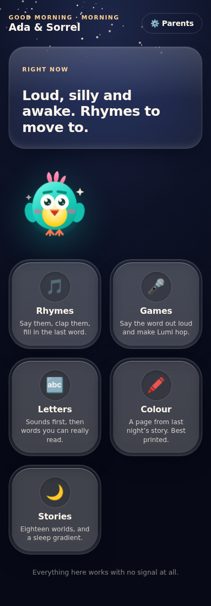 | **Today** — the day-arc banner, the mascot, and the five pillars two-across. No scrolling needed to see every option. |
| 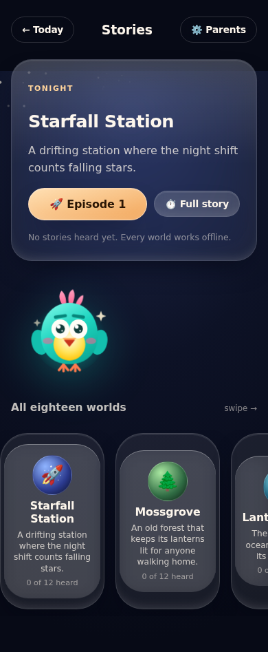 | The world shelf — 18 worlds, swipeable, with a cut-off card at the edge signalling swipe. |
| 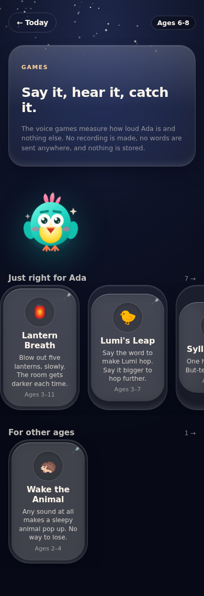 | The arcade — games graded by their own age range, mic-using games badged 🎤. |

### 5.2 The five pillars and eleven screens

`welcome → parental gate → trial/prices → child setup → PIN` then
`Today → {rhymes, games, create, learn, stories} → parent zone → privacy`.

| Figure | Screen |
|---|---|
| 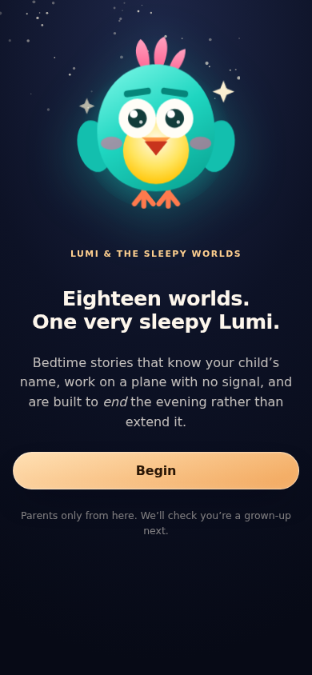 | Welcome |
| 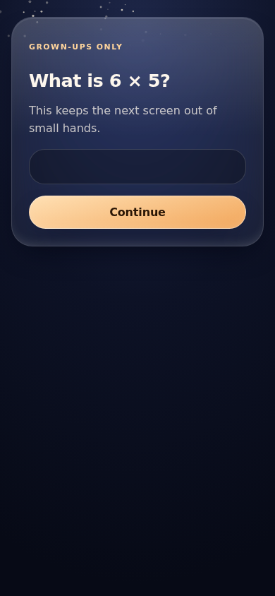 | Parental gate — a multiplication question, the standard "ask a grown-up" pattern |
| 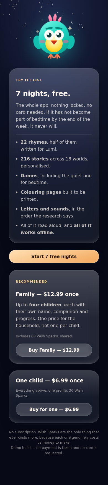 | Trial + prices, shown *before* any purchase and again at the paywall |
| 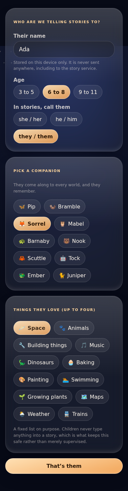 | Child setup — name and age band, stored on-device only |
| 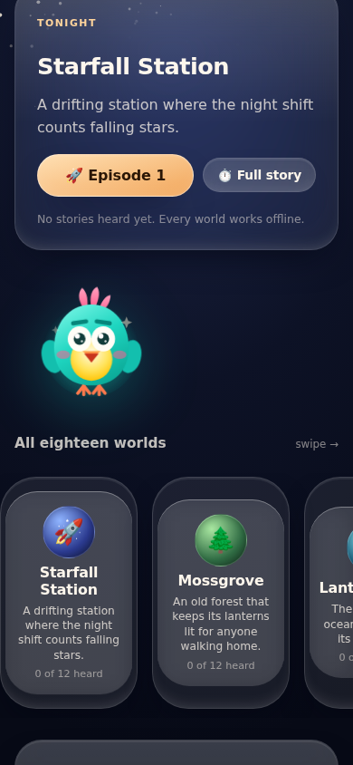 | Story, opening page |
| 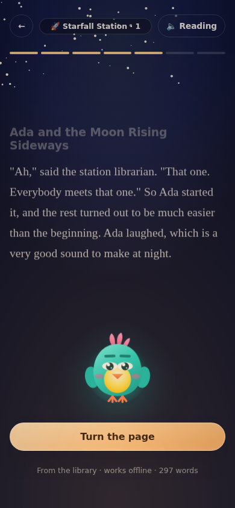 | The same story later — palette warms, screen dims, narration slows, Lumi's eyes close. This is the **sleep gradient** (`calm` 0→1) |
| 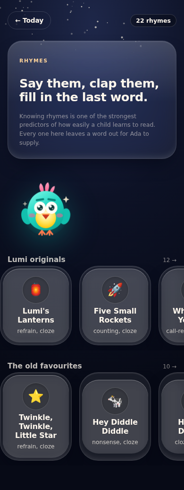 | Rhyme shelves, grouped originals vs traditional |
| 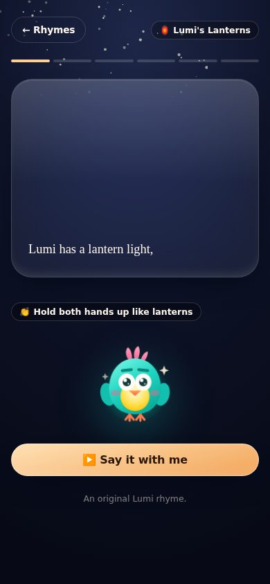 | Rhyme player — word-by-word karaoke, cloze blank, call-and-response |
| 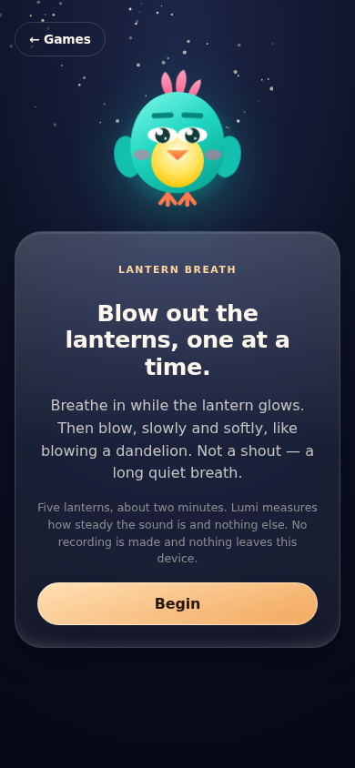 | A voice game in play |
| 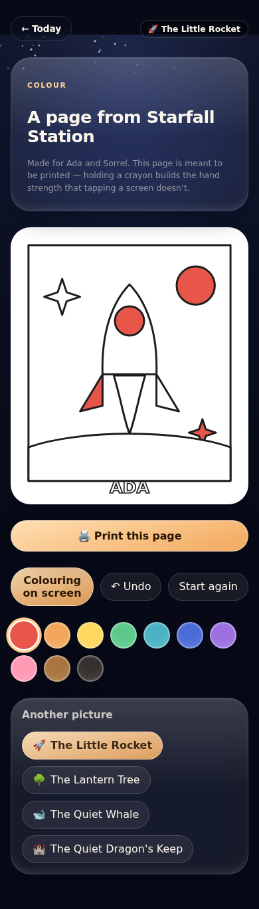 | Colour studio — print-first; the scene follows last night's story |
| 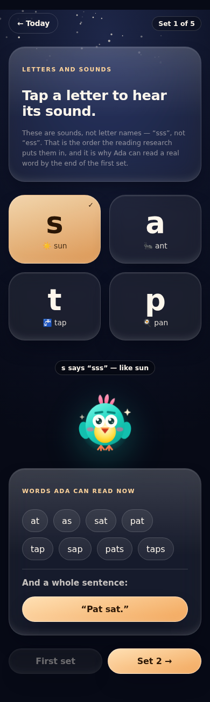 | Letters lab — science-of-reading sequence (s,a,t,p first) |
| 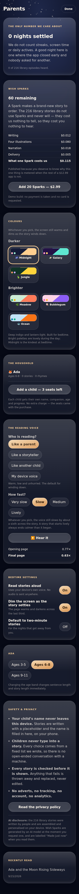 | Parent zone — PIN gated: nights settled, household seats, voice settings, palette picker, the published Wish Spark cost table, AI disclosure |

### 5.3 Six palettes

Three night (Midnight, Galaxy, Jungle) and three day (Meadow, Bubblegum,
Ocean), chosen by the parent, applied as custom-property overrides on `:root`.
The story screen deliberately **keeps its own dark room** under every palette —
a bright bedtime story defeats the point.

| Figure | |
|---|---|
| 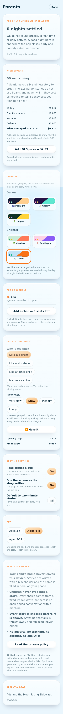 | The picker, with Ocean applied |
| 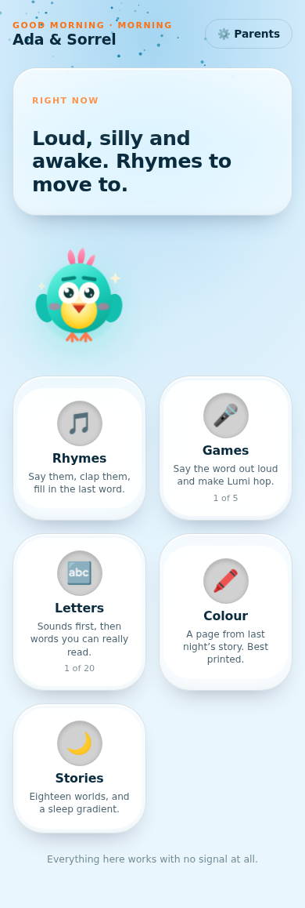 | The whole app in a light palette |
| 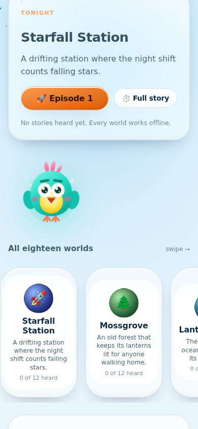 | …and the story staying dark anyway |

Colour grounding: children's colour preference **rises with saturation**, warm
hues slightly dominate, and **deep/dark shades read as negative**. So when two
palettes failed WCAG contrast we **darkened the text, not the accent** —
dulling the accent would have made the app less appealing to the actual user to
satisfy a ratio measured for the buyer.

### 5.4 Lumi, the mascot

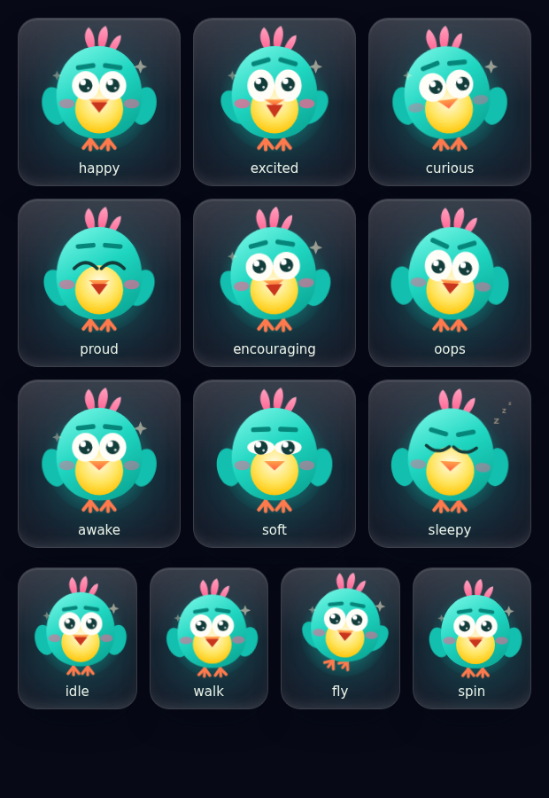

A **turquoise lantern-bird**, hand-built in SVG (no illustration files, no
animation library). Nine moods driven mostly by **eyebrows** — the cheapest,
most legible emotion channel in a small SVG — and four independent body actions
(`idle`, `walk`, `fly`, `spin`) that compose with any mood. Legs pivot at the
hip, wings beat, the crest bobs, and `MascotBuddy` picks a gait from how far it
has to travel and faces the direction of travel.

Two deliberate rules: (a) Lumi's colours are **fixed and do not follow the
palette**, because a mascot that changes colour is not a character; (b) inside
the SVG, geometry positions and CSS animates — mixing the SVG `transform`
attribute with CSS `transform-origin` visibly dislocated the wings.

---

## 6. What we are following (the constraints a proposal must respect)

### The four inviolable rules

1. **Zero marginal cost in the daily loop.** Nothing in rhymes, stories,
   colouring, letters or games may make a paid API call. A one-time price
   against a recurring per-night cost makes every *retained* user a growing
   loss — the founding brutal finding of this project. Anything with a per-call
   price goes behind the metered Wish Spark.
2. **The child's name never leaves the device.** Content is authored with a
   `{child}` placeholder and substituted at render time. Even the Wish Spark
   prompt is assembled from placeholders, so no model ever receives a name.
3. **The child never free-types into a model.** All input comes from fixed,
   parent-approved vocabularies. Every generated story passes `checkStoryText()`
   before render; failures are discarded and recomposed, never patched.
4. **The microphone measures loudness and nothing else.** No `MediaRecorder`,
   no retained buffer, no upload, and never `SpeechRecognition` — on Android it
   ships audio to Google. A voice *recording* is personal information under
   COPPA; an amplitude reading discarded every frame is not.

### The 26 recorded decisions (condensed; full text in `docs/DECISIONS.md`)

**Business:** D1 library-first, generation metered · D6 household pricing never
per-child · D22 free to install, 7 nights, hard paywall.
**Content:** D3 constrained generation never open chat · D7 traditional +
original rhymes, no licensing spend · D8 declared rhyme groups outrank the
spelling heuristic (English spelling cannot resolve *head*/*red*) · D9 colouring
is print-first · D10 learning is a supporting pillar, never the headline ·
D13 every corpus ships a validator test.
**Experience:** D4 the day arc is the spine · D5 no gamification at bedtime ·
D23 wind-down gets its own genre, not a quieter version of a loud one ·
D18 games grade by their own age range · D19 no fail state in voice games.
**Platform:** D2 child PII never leaves the device · D11 on-device TTS only ·
D12 no live image APIs; bundle a curated folder · D14 pluggable TTS interface ·
D17 microphone measures loudness never words · D20 media constraints are
preferences never requirements · D21 the privacy policy is generated from one
source and tested.
**Engineering:** D15 CI is a gate not a notification · D16 additive state fields
do not bump the storage key · D24 six palettes chosen by the parent ·
D25 Lumi is turquoise and does not follow the theme · D26 side-by-side, not stacked.

### Compliance posture

COPPA's amended rule (effective 23 Jun 2025, full compliance 22 Apr 2026),
Google Play Families, Play's AI-content disclosure, and Apple's Kids Category
(1.3 / 5.1.4). Our position is that compliance is a **property of the
architecture**, not a policy document: there is nothing to disclose because
there is nothing collected. `src/__tests__/privacy.test.ts` pins each claim in
the published policy to the code — it fails the build if anything adds a
network call, an analytics dependency, a `MediaRecorder`, a `SpeechRecognition`,
or a second place that persists data. A privacy policy that contradicts the app
is a store *removal*, not a warning.

---

## 7. What is already done

- **Rhymes.** 22 rhymes, word-by-word karaoke, dropped-word cloze, two-voice
  call-and-response, actions, and a rhyme-matching game.
- **Stories.** 18 worlds × 12 episodes, seeded and deterministic, sleep
  gradient, a "Real Window" card with one true public-domain fact per world
  (NASA/NOAA/USGS/Smithsonian/Library of Congress).
- **Create.** Print-first colouring, 4 scenes, scene chosen from last night's
  story, the child's name as outline text, on-screen fallback with undo.
- **Learn.** 5 phonics sets on a science-of-reading sequence, with separate
  display and spoken forms per letter.
- **Games.** Arcade + 4 playable: **Lantern Breath** (blow out five lanterns;
  scores *steadiness*, not loudness, so shouting cannot win — this is the
  invented wind-down genre), **Lumi's Leap**, **Syllable Hop** (requires one
  vocal burst per beat, so a shout cannot fake a long word), **Wake the
  Animal**, **Rhyme Race**. Three more catalogued as `planned` and rendered
  disabled.
- **Family.** Up to 4 children on one purchase, per-child progress, profile
  switcher, add/remove from the parent zone.
- **Parent zone.** PIN gate, nights-settled metric, published Spark cost table,
  voice persona + pace settings, palette picker, AI disclosure.
- **Monetisation logic.** Free install, 7 nights counted per calendar day, hard
  paywall, seat limits. (Payments themselves are stubs.)
- **Privacy.** In-app screen + generated `privacy.html` from one JSON source,
  with tests pinning it to the code.
- **CI/CD.** typecheck → test → build → browser smoke on every push and PR,
  plus a Pages deploy workflow.
- **Design system.** 6 palettes, tile/shelf layout, nine-mood mascot, tokens.

**Verification state:** `npm run typecheck` clean, **201 tests pass**,
`npm run build` clean, all three browser smoke scripts exit 0 with no console
errors.

---

## 8. What is not done — and what worries us

### 8.1 Nothing has ever run on a phone

This is the biggest single risk in the project and it is not close.

- **Neither native shell has been built.** This environment has no Android SDK
  and no macOS. `capacitor.config.json` and the sync scripts are scaffolded and
  **unverified**; `@capacitor/*` is deliberately not installed so the dependency
  tree stays honest about what has actually been tested.
- **The voice path is unverified on real hardware.** The sandbox has no audio
  stack, so Chromium cannot synthesise even a fake microphone. The live meter is
  covered by unit tests only. The smoke test exercises the *no-microphone
  fallback*, which works.
- **`RECORD_AUDIO` (Android) and `NSMicrophoneUsageDescription` (iOS) are not
  applied.** Without them the voice games fail silently on device while passing
  every test here.
- **`AudioContext` resume after a user gesture** is untested; Android WebView is
  stricter than desktop Chromium.
- **Platform TTS quality varies wildly by device** and we have measured it on
  none. A bundled neural voice (Piper / Kokoro) is specced but not spiked.

### 8.2 Store blockers

No app icons, no store screenshots, a placeholder privacy contact
(`privacy@lumisleepyworlds.example`), no hosting for the privacy URL, IAP not
wired (`purchase()` / `addSparks()` are stubs), Apple Developer Program ($99/yr
+ a Mac) and Play Console ($25) not bought.

### 8.3 Product gaps we already suspect

- **The 9–11 band is thin.** Longer stories and harder rhymes are not the same
  as content designed for a child who is embarrassed to be seen with a cartoon
  bird. This may be a positioning error rather than a content gap.
- **No imagery.** Bundled public-domain images are specced and **paused by the
  user**; backdrops are currently pure CSS gradients. On-device image generation
  is explicitly deferred.
- **Three games render as disabled** (Word Builder, Tongue Twister Tower, What
  Comes Next?). Build or drop; do not leave them.
- **The trial resets on reinstall.** Deliberate: enforcing it needs an account,
  which means collecting data from children, which costs more than the handful
  of parents who reinstall to dodge $12.99. Tell us if that is naive.
- **Retention past night 30 is unmodelled.** 216 stories at one a night is
  roughly seven months if a child never repeats a world. What happens in month
  eight is an open question and possibly the real business risk.
- **Discovery.** A paid-feeling app with no ads, no virality, no social, and no
  school channel has no user-acquisition story at all. **This is the gap we are
  least able to see around, and the one we most want you to attack.**

